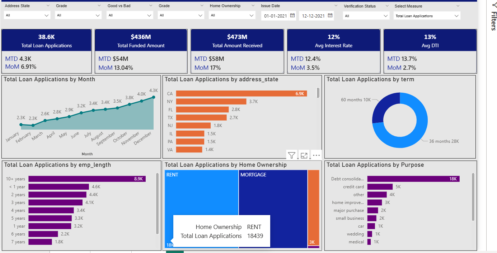
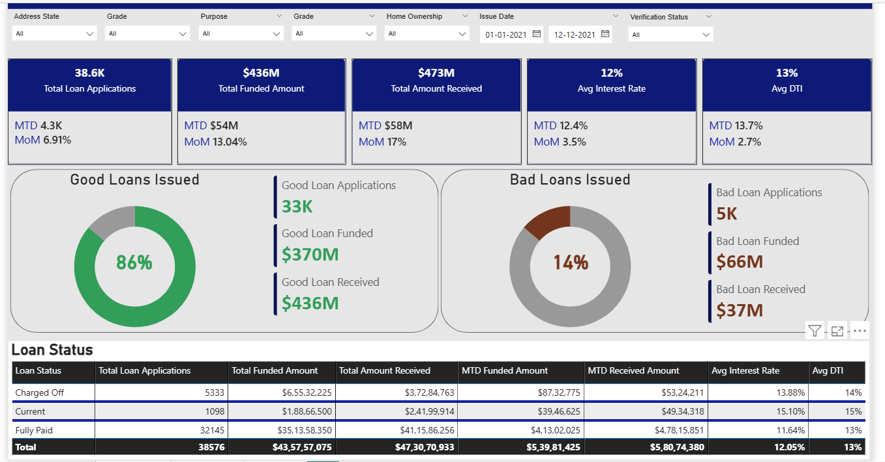
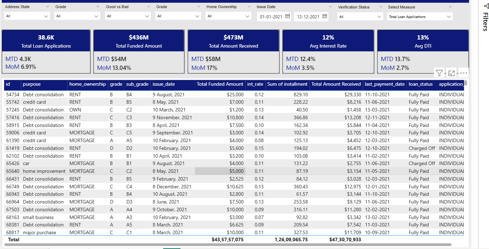
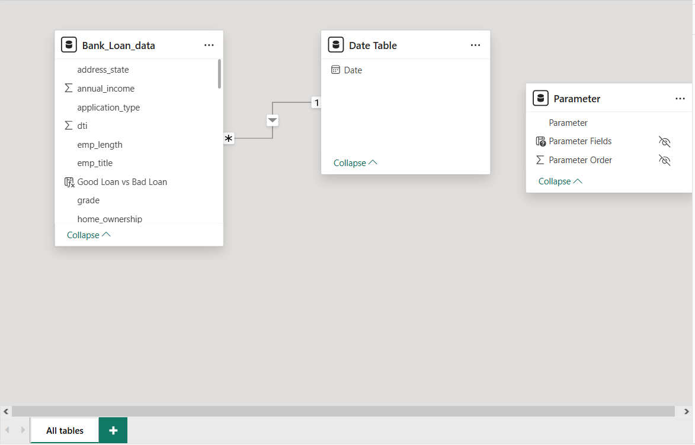

# Bank Loan Analysis (SQL + Power BI)

This project analyzes bank loan performance using SQL and Power BI to identify lending patterns, borrower risk behavior, and loan portfolio performance.

## Project Overview
This project analyzes bank loan performance using SQL for data exploration and Power BI for interactive data visualization.

The goal of this analysis is to understand loan performance, identify risk patterns, and evaluate borrower repayment behavior.

The dashboard provides insights into loan applications, funded amounts, repayments, interest rates, and loan risk classification.

---
## Dashboard Preview

**Main Dashboard Overview**
This dashboard displays high-level KPIs such as total loan applications, total funded amount, total amount received, average interest rate, and average debt-to-income ratio. It also includes breakdowns by state, loan term, home ownership, employment length, and loan purpose.

Loan Performance Summary
This section highlights the distribution between Good Loans and Bad Loans, allowing analysts to quickly evaluate portfolio health and risk exposure.

Loan Details Table
A detailed table showing individual loan records including loan purpose, home ownership status, loan grade, installment amount, total payment received, and loan status.

Data Model
The Power BI data model showing relationships between the main loan dataset and the date table used for time-based analysis and filtering.

---

## Tools & Technologies

- SQL Server
- Power BI
- Power Query
- Data Modeling
- Data Visualization

---

## Dataset

The dataset contains detailed information about loan applications including:

- Loan ID
- Loan Amount
- Funded Amount
- Total Payment Received
- Loan Status
- Interest Rate
- Debt to Income Ratio
- Borrower State
- Employment Length
- Loan Purpose

---

## Key Business Questions

This project answers several important business questions:

1. How many loan applications were received?
2. What is the total funded loan amount?
3. What is the total repayment received from borrowers?
4. What percentage of loans are good loans vs bad loans?
5. What is the average interest rate charged to borrowers?
6. What is the average debt-to-income ratio of borrowers?

---

## SQL Analysis

SQL queries were used to analyze the dataset and calculate the main KPIs.

Example queries include:

- Total Loan Applications
- Total Funded Amount
- Total Amount Received
- Average Interest Rate
- Average Debt to Income Ratio
- Good Loans vs Bad Loans

The SQL queries used in this project are available in the file:

`sql_queries.sql`

---

## Power BI Dashboard

The Power BI dashboard provides an interactive view of the loan portfolio.

### Dashboard Features

- KPI Cards for key metrics
- Good Loans vs Bad Loans analysis
- Loan Status summary table
- Loan performance insights

---

## Key Metrics

| Metric | Value |
|------|------|
| Total Loan Applications | 38.6K |
| Total Funded Amount | $436M |
| Total Amount Received | $473M |
| Average Interest Rate | 12% |
| Average DTI | 13% |

---

## Project Files
Bank Loan Dashboard_Project.pbix → Power BI dashboard
Bank_Loan_data.csv → Dataset
sql_queries.sql → SQL analysis queries

---

## Business Insights

- The majority of loans are classified as **good loans (86%)**
- Only **14% of loans are bad loans**
- The average borrower interest rate is around **12%**
- Borrowers have an average **DTI ratio of approximately 13%**

These insights help financial institutions evaluate loan risk and portfolio performance.

---

## Author

**Jibin Peter**

Business Analyst | Data Analytics Enthusiast
